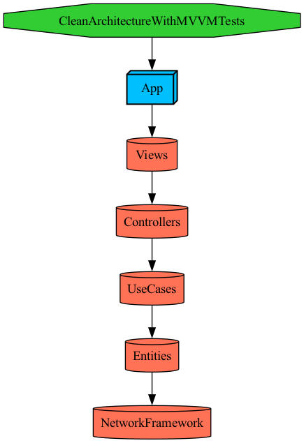

# 클린 아키텍쳐 + MVVM 활용 포트폴리오

## 1. 프로젝트 설명
###
이 프로젝트는 [API](https://jsonplaceholder.typicode.com/users)를 사용하여 받은 데이터를 List화면으로 보여주고 터치 시 상세화면으로 이동 및 각 데이터 타입에 맞춰서 정보를 보여줍니다.

### 1.1. 프로젝트 작성 규칙
- 의존성 흐름 제어 (단방향)
- Model - View - ViewModel 패턴 사용. 
- UI는 SwiftUI만 사용한다.
- 외부 라이브러리 사용금지.
- 통신모듈 URLSession을 사용하여 구현.
- 데이터 파싱은 Codable을 채택하여 구조체로 관리 및 사용.

### 1.2. 구현
- List - Detail - WebView 구조
- name, username, email 리스트에 사용
- 나머지 데이터 상세화면에 사용
- URL 데이터로 WebView에 사용
- 전화번호>전화연결, 이메일>이메일연결
- 상세화면 MapView에 Geo 정보로 pin 표시
- Pull To Refresh 구현
- 통신 실패 시 에러 팝업

## 2. 프로젝트 설정
### 2.1. [Tuist](https://docs.tuist.dev/ko/#installation) 기반으로 작성
Mise를 이용하여 설치하였으며 Tuist 버전은 4.45.0 기준으로 작성되었습니다. ([mise.toml](./mise.toml) 참고)

## 3. 프로젝트 의존성
</img>

## 4. GIT Message Convention
- feat: 새로운 기능
- fix: 버그 수정
- docs: 문서 변경 사항
- style: 코드 스타일 관련 변경 (주석, 공백 변경, 개행 처리)
- refactor: 코드 리팩토링
- test: 테스트 코드
- chore: 빌드 작업 (프로젝트 설정 변경, 패키지 관리자 변경, 라이브러리 추가 및 삭제)
